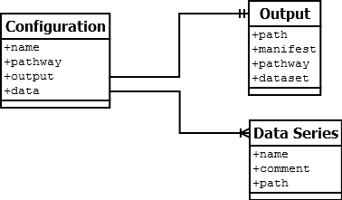

# USER MANUAL FOR PATHWAYS PIPELINE SCRIPTS

The use of file extensions in any path for an input argument is optional.  This is so that if the extension is forgotten, the system can determine the appropriate extensions itself, especially for output files.

## pathways.py

```
Usage: pathways [-k pathway] [-p paladin_tsv] [-o output] [-c counts] [-v]
    Script runs entire pathways pipeline, filtering a read report from PALADIN
    to calculate the mathmatical completeness of a given metabolic pathway.

    -k pathway      - KEGG ID for pathway
    --kegg
    -p paladin_tsv  - path to PALADIN output report
    --paladin
    -o output       - output file name
    --output
    -c counts       - supplement data file name
    -v              - verbose mode (print more info to stdout)
    --verbose

    EXAMPLE: python3 pathways.py -k 00625 -p ./data/report.tsv -o results.csv -c counts.dat 
```

Output will also provide the names of any files produced during the process.  Included is the completeness results, JSON-formatted pathway markup, and a log file that contains the output from main script.  Output redirection is fine too.

```
python3 pathways.py -k 00625 -p ./data/report.tsv -o results.csv -c counts.dat -v > foo.log 
```

### Notes

* Pathway ID can either be looked up on [KEGG](http://www.kegg.jp/kegg-bin/get_htext?br08901.keg) or in the list (pathway-ids.md) in this folder.
* One of the automatically generated files is a CSV-formatted filtered view of the PALADIN report and contains the following columns:
    * UniProt cluster ID
    * [BRENDA](http://www.brenda-enzymes.org/ecexplorer.php) Enzyme Commission (EC) number
    * Name of the representative gene sequence
    * Organism matching given gene
    * Count (number of reads detected)
    * Relative abundance of gene in sample
* The standard _Pathways_ output report contains the following
    * EC numbers of pathway enzymes present in sample
    * EC numbers of missing enzymes
    * Mathematical (geometric) completeness of pathways, given as a percent
        * This quantity does not suggest completeness in terms of biological function
* There is also an optional "counts" report which provides more information and a report needed for _Pathways_ heatmap visualization
    * EC number
    * Representative sequence name
        * If enzyme was not detected by PALADIN, _Pathways_ will request names from KEGG's REST API
        * This does not apply to category listings with no reads (e.g. 1.7.-.-) as many genes are possible
    * Read count
* A JSON-formatted version of KEGG's pathway markup will also be generated by the process for use with `visbuilder.py`

## visbuilder.py

```
Usage: visbuilder.py CONFIG
    Script loads a user-created build configuration file and assembles the
    CSV dataset needed for pathway visualizer based on data aggregated from
    files specified by the configuration.

    CONFIG      - path to JSON-formatted build configuration file

    EXAMPLE: python3 visbuilder.py configuration.json
```

### Notes

* This script uses the JSON-formatted KGML from `pathways.py` as well as one or more of the output reports (named using the `-o` flag)
* Labeling and arrangement of these files is done with a user-created configuration manifest as defined below
* *All file paths in configuration are relative to the **current working directory** of the shell*

```
{
  "name" : "Swedish KB-1 Bioaugmentation Time Series",
  "pathway" : "test00625.json",
  "output" : {
    "path" : "vis/",
    "manifest" : "manifest.json",
    "pathway" : "demo00625.json",
    "dataset" : "presentation_demo.csv"
  },
  "data" : [
    {
      "name" : "MW1_J1",
      "comment" : "Well 1 - June",
      "path" : "magic/MW1_J1.csv"
    },
    {
      "name" : "MW1_O1",
      "comment" : "Well 1 - October",
      "path" : "magic/MW1_O1.csv"
    }
  ]
}
```



#### Field Descriptions

* **Name:** title for visualization (will appear in pathway visualization
* **Pathway:** path to KGML JSON generated by fetch_kgml.py
* **Output:** definition for output files (path will be generated if it does not exist)
    * **Path:** directory for output files
    * **Manifest:** name of manifest JSON file used by the pathway visualization to know what the data source files are named and where they are located (the visualization still expects “manifest.json” to exist for this purpose)
    * **Pathway:** name of KGML output containing extra data added for the visualization
    * **Dataset:** name of file containing each data series aggregated as records
* **Data:** contains one or more entities describing input data generated by magic.py
    * **Name:** title for data series (will appear in visualization legend)
    * **Comment:** description of series (not used in current version)
    * **Path:** location of data file (must be the main output CSV from magic.py—not the supplemental reports)
